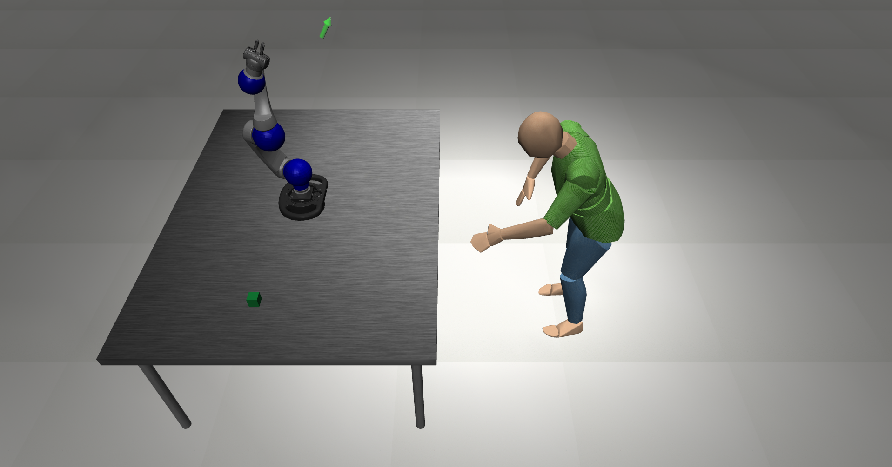
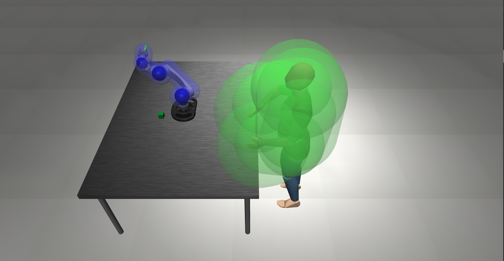

Demos and Tutorials
=====================

For a demo of the basic human environment with a Schunk robot and the safety shield activated, run the following command:

.. code-block:: bash

    python human_robot_gym/demos/demo_gym_functionality_Schunk.py

This will show you a demo of a simple P-controller as "agent" and a human.



**Demo files are a crucial tool to test and debug your environment before training.**

Here, we will give an explanation of the code used in the demo:

.. code-block:: python

    controller_config = dict()
    controller_conig_path = file_path_completion("controllers/failsafe_controller/config/failsafe.json")
    robot_conig_path = file_path_completion("models/robots/config/schunk.json")
    controller_config = load_controller_config(custom_fpath=controller_conig_path)
    robot_config = load_controller_config(custom_fpath=robot_conig_path)
    controller_config = merge_configs(controller_config, robot_config)
    controller_configs = [controller_config]

These are preliminary config definitions for the safety shield that won't be necessary in the future.

.. code-block:: python

    env = GymWrapper(
        suite.make(
            "ReachHuman",
            robots="Schunk",  # use Sawyer robot
            robot_base_offset=[0, 0, 0],
            use_camera_obs=False,  # do not use pixel observations
            has_offscreen_renderer=False,  # not needed since not using pixel obs
            has_renderer=True,  # make sure we can render to the screen
            render_camera=None,
            render_collision_mesh=False,
            reward_shaping=True,  # use dense rewards
            control_freq=5,  # control should happen fast enough so that simulation looks smooth
            hard_reset=False,
            horizon=1000,
            controller_configs=controller_configs,
            use_failsafe_controller=True,
            visualize_failsafe_controller=False,
            visualize_pinocchio=False,
            base_human_pos_offset=[1.0, 0.0, 0.0],
            verbose=True,
            goal_dist=0.0001,
            human_rand=[1.0, 0.5, 0.2]
        ),
        keys=[
            "object-state",
            "robot0_proprio-state",
            "goal_difference"
        ]
    )

Here, we create the environment.
Since we are based on robotsuite, the robosuite environment is created first with ``suite.make()``.
Here are a few arguments that you can play around with:

    - ``id```: The id of the environment. In this case, we use the ``ReachHuman`` environment.
    - ``has_renderer``: Whether to render the environment or not. Should be false for training.
    - ``control_freq``: The frequency at which the agent outputs an action in Hz.
    - ``use_failsafe_controller``: Whether to use the safety shield or not.
    - ``visualize_failsafe_controller``: Visualize the reachable occupancies of the safety shield.
    - ``visualize_pinocchio``: Visualize the pinocchio robot model, which is used for static- and self-collision prevention in the ``CollisionPreventionWrapper``.
    - ``keys``: The observation keys that are returned by the environment. In this case, we use the object state, the robot state and the goal difference.

If you visualize the failsafe controller, you will see something like this:



In blue and green, you see the reachable occupancies of the robot and human respectively.
If these two sets intersect, the safety shield slows down the robot.
We consider the robot as safe if it is at a complete stop in the case of a collision with the human.
For more information, see the :doc:`safety shield section</safety_shield>`.

.. code-block:: python

    env = CollisionPreventionWrapper(
        env=env, collision_check_fn=env.check_collision_action, replace_type=0
    )

    env = VisualizationWrapper(env)

After creating an environment, we can wrap it in a bunch of different wrappers.
For more information see the :doc:`wrappers section</wrappers>`. 
Here, we use the ``CollisionPreventionWrapper`` to prevent collisions with the static environment (table) and self-collisions, plus the ``VisualizationWrapper`` to render the environment.

.. code-block:: python

    t_max = 100
    for i_episode in range(20):
        observation = env.reset()
        t1 = time.time()
        for t in range(t_max):
            action = env.action_space.sample()
            pos = np.array([env.sim.data.qpos[x] for x in env.robots[0]._ref_joint_pos_indexes])
            goal = env.desired_goal
            action[:pos.shape[0]] = np.clip(goal-pos, -0.5, 0.5)
            observation, reward, done, info = env.step(action)
            print("Reward: {}".format(reward))
            if done or t == t_max:
                print("Episode finished after {} timesteps".format(t + 1))
                break
        print("Episode {}, fps = {}".format(i_episode, t / (time.time() - t1)))

This is a simple loop that runs the environment for 20 episodes.
As the action, we define a simple P-controller that moves the robot to the goal position.
You can also use your own actions here.

More demos can be found in the ``demos`` folder:

    - ``demo_gym_functionality_Schunk_IK.py``: Demo of the inverse kinematics wrapper, which allows actions in Euclidean space instead of joint space.
    - ``demo_gym_functionality_pick_place_IK.py``: Demo of a pick and place task with the inverse kinematics wrapper.